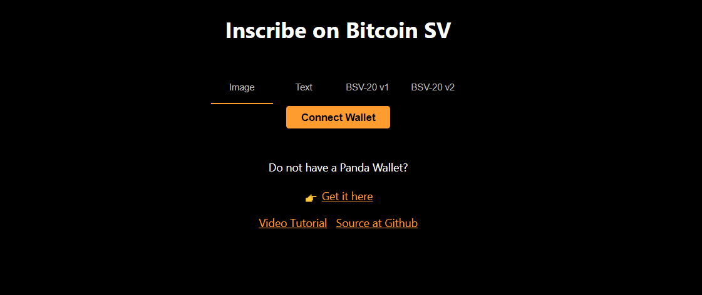

# Chapter 1: Course overview

In this course, you will learn what are Ordinals, and even learn how to inscribe images, text and bsv-20 both version 1 and 2.

The course is very simple and you will developed a platform that will allow user to simply inscribe Text, images and bsv-20 tokens on both main and testnet.

We will build in two steps:

1. Ordinals basics
2. Image inscription
3. Text inscription
4. bsv20-v1
5. bsv20-v2

## How it works

Before starting this course, you can try and see how it works [Inscribe](https://inscribe.scrypt.io)

