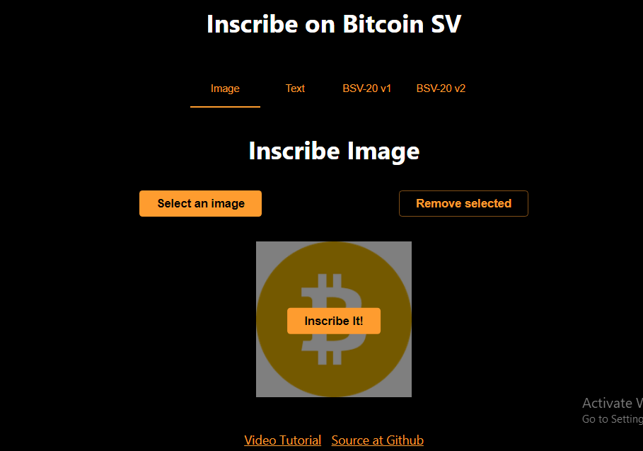

# Chapter 4: Inscribe Image
## Introduction:
The OrdinalImage.tsx file contains a React component named OrdinalImage. 
This component is designed to facilitate the inscription of images using the OrdiNFTP2PKH class from the scrypt-ord library. 
Let's break down the key features of this component.

So, i will take through with step by step explaination and you can also get the complete code at [Github](https://github.com/sCrypt-Inc/inscribe/blob/master/src/ordinalImage.tsx)



```ts

function OrdinalImage(props) {
  const { _ordiAddress, _signer } = props;
  const connected = () => _ordiAddress !== undefined;
  const [result, setResult] = useState<string | undefined>(undefined);
  const [images, setImages] = useState<ImageListType>([]);

  const inscribe = async () => {
    try {
      const signer = _signer as PandaSigner;
      const instance = new OrdiNFTP2PKH(Addr(_ordiAddress!.toByteString()));
      await instance.connect(signer);

      // Extracting image data and converting to base64
      const image = images[0];
      const b64 = Buffer.from(await image.file!.arrayBuffer()).toString('base64');

      // Inscribing the image
      const inscribeTx = await instance.inscribeImage(b64, image.file!.type);

      setResult(`Inscribe Tx: ${inscribeTx.id}`);
      setImages([]);
    } catch (e: any) {
      console.error('error', e);
      setResult(`${e.message ?? e}`);
    }

    // Event tracking
    if (window.gtag) {
      window.gtag('event', 'inscribe-image');
    }
  };

  const text: React.RefObject<HTMLInputElement> = useRef(null);

  // Render UI
  return (
    <Container maxWidth="md">
      {!connected() && <Navigate to="/" />}
      <Box sx={{ my: 4 }}>
        <Typography variant="h4" component="h1" gutterBottom align="center">
          Inscribe Image
        </Typography>
      </Box>
      <Box sx={{ mt: 3 }}>
        {/* ImageUploading component for handling image selection */}
        <ImageUploading value={images} onChange={onImagesChange} dataURLKey="data_url">
          {({ imageList, onImageUpload, onImageRemoveAll, isDragging, dragProps }) => (
            <>
              <Box sx={{ display: 'flex', justifyContent: 'space-evenly', alignItems: 'center' }}>
                <Button variant="contained" color="primary" onClick={onImageUpload}>
                  Select an image
                </Button>
                <Button variant='outlined' color="secondary" onClick={onImageRemoveAll}>
                  Remove selected
                </Button>
              </Box>
              {/* Displaying selected images with an option to inscribe */}
              {imageList.map((image, index) => (
                <Box sx={{ position: 'relative', width: '100%', mt: 4, display: 'flex', justifyContent: 'center', alignItems: 'center' }} key={index}>
                  <Box sx={{ position: 'relative' }}>
                    
                    <Box sx={{ position: 'absolute', top: 0, left: 0, width: '100%', height: '100%', backgroundColor: 'rgba(0, 0, 0, 0.5)' }} />
                  </Box>
                  {/* Button to inscribe the image */}
                  <Button variant="contained" color="primary" sx={{ position: 'absolute', top: '50%', left: '50%', transform: 'translate(-50%, -50%)', zIndex: 1 }} onClick={inscribe}>
                    Inscribe It!
                  </Button>
                </Box>
              ))}
            </>
          )}
        </ImageUploading>
      </Box>
      {/* Displaying the result of the inscription */}
      {result && (
        <Box sx={{ mt: 3 }}>
          <Typography variant="body1">{result}</Typography>
        </Box>
      )}
    </Container>
  );
}

export default OrdinalImage;

```
## 2. Component Breakdown:

**2.1. Initialization:**
The component starts by importing necessary dependencies and initializing state variables using the useState hook. It also defines a Ref for handling text input.

**2.2. Connected Check:**
The connected function checks whether the user is connected by verifying the existence of the _ordiAddress variable.

**2.3. Image Handling:**
The component uses the ImageUploading component for handling image selection. It provides buttons for uploading, removing, and inscribing selected images.

**2.4. Image Inscription:**
The inscribe function is an asynchronous operation that uses the selected image's data to inscribe it using the OrdiNFTP2PKH instance. The result of the inscription is displayed, and any errors are caught and displayed as well.

**2.5. Event Tracking:**
If window.gtag is available, an event is tracked when the inscribe function is called.

**2.6. UI Rendering:**
The component renders a user interface with a title, image selection buttons, and a button to inscribe the selected image. The result of the inscription is displayed below the UI.

**2.7. Navigation:**
If the user is not connected (!connected()), the component redirects the user to the home page using the Navigate component from React Router.

**3. Usage:**
To use this component, integrate it into your React application. Ensure that the necessary dependencies (react, react-router-dom, @mui/material, scrypt-ord, scrypt-ts, react-images-uploading) are installed.
