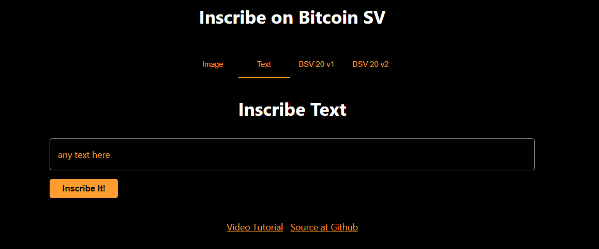

# Chapter 5: Text Inscription

## Introduction:
The OrdinalText.tsx file contains a React component named OrdinalText. 
This component is designed to facilitate the inscription of Text using the OrdiNFTP2PKH class from the scrypt-ord library. 
Let's break down the key features of this component.

So, i will take through with step by step explaination and you can also get the complete code at [Github](https://github.com/sCrypt-Inc/inscribe/blob/master/src/ordinalText.tsx)



```ts
function OrdinalText(props) {
  // Destructuring props to access _ordiAddress and _signer
  const { _ordiAddress, _signer } = props;

  // Function to check if the user is connected
  const connected = () => _ordiAddress !== undefined;

  // State variable to store the result of the inscription operation
  const [result, setResult] = useState<string | undefined>(undefined);

  // Ref to store the text input element
  const text: React.RefObject<HTMLInputElement> = useRef(null);

  // ...
}

```
**useState:** Initializes the **result** state variable to store the outcome of the text inscription operation.

**useRef:** Creates a ref (**text**) to access the text input element.

**connected:** A function that checks if **_ordiAddress** is defined, indicating whether the user is connected.


```ts
const mint = async () => {
  try {
    const signer = _signer as PandaSigner;

    // Retrieve the text value from the input field
    const value = text.current?.value;

    if (value !== undefined) {
      // Create an instance of OrdiNFTP2PKH
      const instance = new OrdiNFTP2PKH(Addr(_ordiAddress!.toByteString()));

      // Log the value to the console
      console.log("value:", value);

      // Connect to the signer
      await instance.connect(signer);

      // Inscribe the text
      const inscriptionTx = await instance.inscribeText(value);

      // Set the result with the inscription ID
      setResult(`Text Inscription ID: ${inscriptionTx.id}`);
    } else {
      // Handle the case where the input value is undefined
      setResult("Error: Input value is undefined");
    }
  } catch (e: any) {
    // Log and display any errors that occur during the inscription
    console.error('error', e);
    setResult(`${e.message ?? e}`);
  }

  // Track the 'inscribe-text' event if window.gtag is available
  if (window.gtag) {
    window.gtag('event', 'inscribe-text');
  }
};

```

**mint Function:** An asynchronous function responsible for handling the inscription process.

**Value Retrieval:** Retrieves the text value from the input field using the **text** ref.

**OrdiNFTP2PKH Instance:** Creates an instance of **OrdiNFTP2PKH** using the provided **_ordiAddress**.

**Connect to Signer:** Connects to the signer using **await instance.connect(signer)**.

**Inscribe Text:** Calls **instance.inscribeText(value)** to inscribe the text and obtains the inscription transaction ID.

**Result Handling:** Sets the **result** state with the inscription ID or an error message if the input value is undefined.

**Error Handling:** Catches any errors that occur during the inscription process, logs them, and sets the **result** state with the error message.

**Event Tracking:** If **window.gtag** is available, tracks the 'inscribe-text' event.

```ts
return (
  <Container maxWidth="md">
    {!connected() && <Navigate to="/" />}
    <Box sx={{ my: 4 }}>
      <Typography variant="h4" component="h1" gutterBottom align="center">
        Inscribe Text
      </Typography>
    </Box>
    <Box sx={{ mt: 3 }}>
      <TextField inputRef={text} label="any text here" variant="outlined" fullWidth />

      <Button
        variant="contained"
        color="primary"
        sx={{ mt: 2 }}
        disabled={!connected()}
        onClick={mint}>
        Inscribe It!
      </Button>
    </Box>
    {result && (
      <Box sx={{ mt: 3 }}>
        <Typography variant="body1">{result}</Typography>
      </Box>
    )}
  </Container>
);
```

**Navigation:** Redirects to the home page using **Navigate** if the user is not connected.

**Typography:** Displays a heading for the "Inscribe Text" section.

**Text Input Field:** Provides a Material-UI **TextField** for user input.

**Inscribe Button:** A button that triggers the **mint** function. It is disabled if the user is not connected.

**Result Display:** Conditionally displays the result below the button if there is a result (**result** is truthy).
