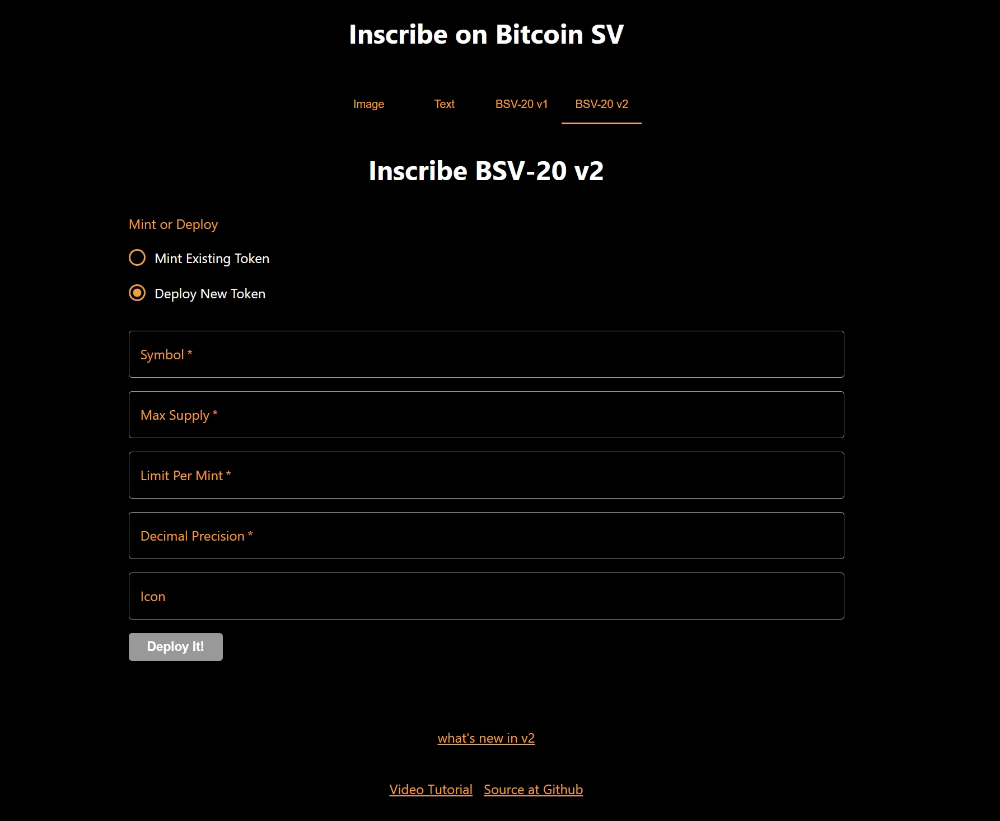

# Chapter 6: BSV20-V2 
## Introduction:
The **BSV20 - V2** file contains a React component named BSV20v2. 
This component is designed to facilitate the inscription of **BSV20 - V2** using the OrdiNFTP2PKH class from the scrypt-ord library. 
Let's break down the key features of this component.

So, i will take through with step by step explaination and you can also get the complete code at [Github](https://github.com/sCrypt-Inc/inscribe/blob/master/src/bsv20v2.tsx)



```ts

function BSV20v2(props) {

    const { _ordiAddress, _signer } = props

    const connected = () => {
        return _ordiAddress !== undefined
    }

    const [_symbol, setSymbol] = useState<string | undefined>(undefined)
    const [_amount, setAmount] = useState<bigint | undefined>(undefined)
    const [_decimal, setDecimal] = useState<bigint | undefined>(undefined)
    const [_icon, setIcon] = useState<string | undefined>(undefined)

    const symbolOnChange = (e) => { setSymbol(e.target.value) }

    const amountOnChange = (e) => {
        if (/^\d+$/.test(e.target.value)) {
            setAmount(BigInt(e.target.value))
        } else {
            setAmount(undefined)
        }
    }

    const iconOnChange = (e) => {
        if (isBSV20v2(e.target.value)) {
            setIcon(e.target.value)
        } else {
            setIcon(undefined)
        }
    }

    const decimalOnChange = (e) => {
        if (/^\d+$/.test(e.target.value)) {
            setDecimal(BigInt(e.target.value))
        } else {
            setDecimal(undefined)
        }
    }

    const validInput = () => {
        return _symbol !== undefined && _amount !== undefined && _decimal !== undefined
    }

    const [_result, setResult] = useState<string | undefined>(undefined)

    const mint = async () => {
        try {
            const signer = _signer as PandaSigner
            const symbol = toByteString(_symbol!, true)
            const instance = new BSV20V2P2PKH(toByteString(''), symbol, _amount!, _decimal!, Addr(_ordiAddress!.toByteString()))
            await instance.connect(signer)

            const tokenId = await instance.deployToken(_icon ? {
                icon: _icon
            } : {})
            setResult(`Token ID: ${tokenId}`)

            setSymbol(undefined)
            setAmount(undefined)
            setDecimal(undefined)
            setIcon(undefined)
        } catch (e: any) {
            console.error('error', e)
            setResult(`${e.message ?? e}`)
        }

        if (window.gtag) {
            window.gtag('event', 'inscribe-bsv20v2');
        }
    }

    return (
        <Container maxWidth="md">
            {!connected() && (<Navigate to="/" />)}
            <Box sx={{ my: 4 }}>
                <Typography variant="h4" component="h1" gutterBottom align="center">
                    Inscribe BSV-20 v2
                </Typography>
            </Box>
            <Box>
                <Typography variant="body1" align="center">
                    <a style={{ color: "#FE9C2F" }} href="https://docs.1satordinals.com/bsv20#new-in-v2-tickerless-mode" target="_blank" rel="noreferrer">what's new in v2</a>
                </Typography>
            </Box>
            <Box sx={{ mt: 3 }}>
                <TextField label="Symbol" variant="outlined" fullWidth required onChange={symbolOnChange} />
                <TextField label="Amount" type="number" variant="outlined" fullWidth required sx={{ mt: 2 }} onChange={amountOnChange} />
                <TextField label="Decimal" type="number" variant="outlined" fullWidth required sx={{ mt: 2 }} onChange={decimalOnChange} />
                <TextField label="Icon" variant="outlined" placeholder="1Sat Ordinals NFT origin" fullWidth sx={{ mt: 2 }} onChange={iconOnChange} />
                <Button variant="contained" color="primary" sx={{ mt: 2 }} disabled={!connected() || !validInput()} onClick={mint}>
                    Mint It!
                </Button>
            </Box>
            {
                !_result
                    ? ''
                    : (<Box sx={{ mt: 3 }}><Typography variant="body1">{_result}</Typography></Box>)
            }
        </Container>
    )
}

```
**scrypt-ord Libraries:** Imports classes and utility functions related to **BSV20v2**, such as **BSV20V2P2PKH** for token instantiation and isBSV20v2 for checking if a given string is a valid **BSV20v2** token.

**Scrypt Libraries:** Imports functionality for handling addresses, signing transactions, and converting values to byte strings from the **scrypt-ts** library.

**React Router:** Imports **Navigate** from **react-router-dom** for programmatic navigation.

**Function Component:** Declares a functional React component named **BSV20v2** that takes **props** as its parameter.

**State Variables:** Uses the **useState** hook to declare state variables like **_symbol**, **_amount**, **_decimal**, **_icon**, and **_result**.

**Return Statement:** Returns JSX content wrapped in a Material-UI **Container** component.

**Connected Function:** Defines a function **connected** that checks if **_ordiAddress** is defined, indicating whether the component is connected to an address.

**State Variables:** Declare state variables using **useState** for **symbol**, **amount**, **decimal**, and **icon**. Initial values are set to undefined.

**Event Handlers:** Define event handlers (**symbolOnChange**, **amountOnChange**, **iconOnChange**, **decimalOnChange**) to update state variables based on user input.

**Valid Input Function:** Defines a function validInput that checks if required input fields are defined, enabling or disabling the **`Mint It!`** button accordingly.

**Minting Function:** Defines a function **mint** to handle the minting logic. It interacts with the BSV blockchain, deploys a BSV20v2 token, and updates the result state. It also logs events using **window.gtag**.
