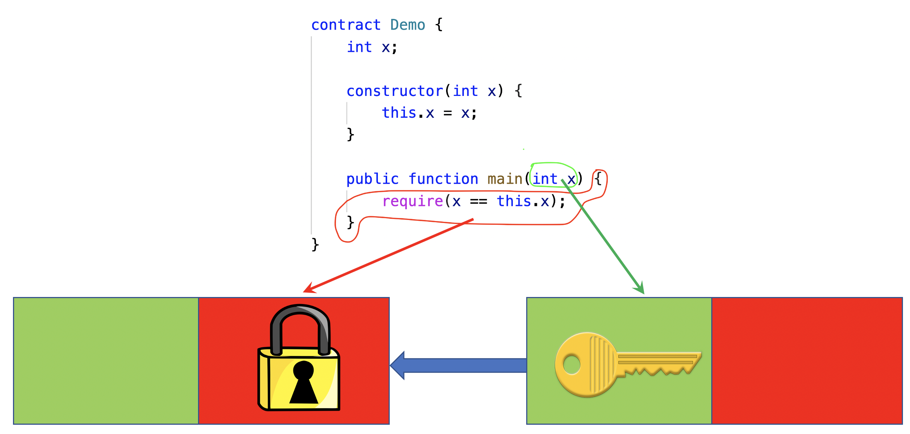
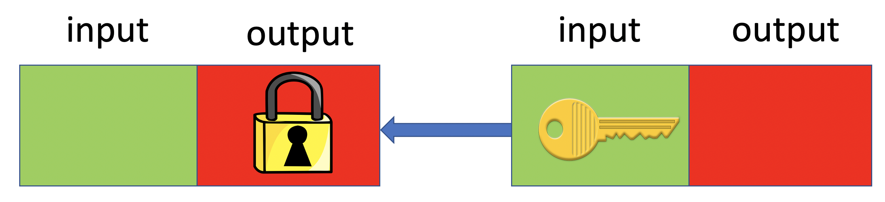
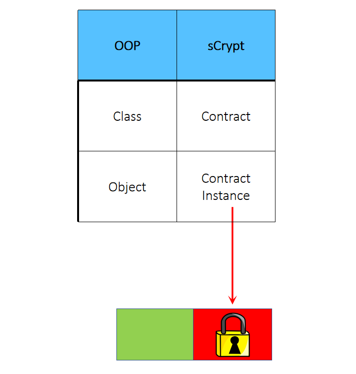

# 第十章: 比特币脚本

## 比特币 UTXO 模型

比特币底层采用了一个很特别的交易模型设计，即 UTXO（Unspent Transaction Outputs） 模型：

UTXO模型主要包括两部分：输入记录和输出记录。输入包含解锁脚本，输出包含锁定脚本。

## 脚本与合约

比特币脚本是一种基于栈的脚本语言。它是一串由操作码（opcode）组成的指令集合。验证解锁脚本时，将锁定脚本连接在解锁脚本的后面，从而形成完整的执行脚本。

任何花费 **UTXO** 的行为都可以看做是一个合约的调用：解锁脚本对应公共函数的参数，锁定脚本对应公共函数的函数体。

合约被编译成一段锁定脚本模板。实例化合约实际上就是实例化一段锁定脚本模板。当合约被调用时，会将解锁参数与这段解锁脚本拼接起来，从而形成完整的执行脚本。

任何花费比特币的行为都可以看做是一个合约的执行。借助于比特币脚本语言的通用性及灵活表达性，可以在比特币网络上执行任意复杂的合约。